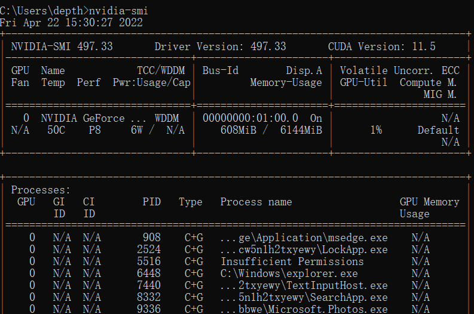

# 深度学习环境配置——CUDA、Cudnn、Pytorch

前些年自己配置深度学习环境，都是按照一个比较古老的教程完成的；尤其是CUDA和cudnn等软件版本的搭配，为避免麻烦，更是直接采用了教程中使用的古老版本。但本次重装系统时发现，这些软件版本过于老旧，有的已经无法支持。因此决定自己尝试安装新版本的深度学习环境。

## 一、设备环境与软件版本

**显卡**：1660ti

**Anaconda3**：Anaconda3-2021.11-Windows-x86_64；**conda**：conda 4.10.3；**python**：python 3.9.7

**CUDA**：CUDA 11.3.1；**Pytorch**：Pytorch 1.11.0

## 二、配置步骤

### Step1：安装Anaconda3（附带conda与python）

从Anaconda官网（https://www.anaconda.com/）下载

**Anaconda版本**：Anaconda3-2021.11-Windows-x86_64

> 安装过程中，这一步一定要注意，<font color="red">勾选第一项“Add Anaconda to my PATH environment variable”</font>
>
> <div align="center"></div>
>
> 

**测试conda**：

在cmd命令行中，输入`conda list`：

<div align="center"></div>

再输入`conda --version`，查看conda版本。可以看到，当前conda版本为4.10.3。

<div align="center"></div>

最后，直接输入`python`，查看python版本。可以看到，当前python版本为3.9.7。

<div align="center"></div>

此时，Anaconda、conda与python均安装完成。

### Step2：安装CUDA

首先可以在cmd中输入`nvidia-smi`来查看自己的显卡所支持的CUDA最高版本是多少，如下图中右上角的“CUDA Version”所示，我的显卡最高可以支持11.5版本的CUDA，那么再往上的版本（如CUDA11.6）我就不能使用了。

<div align="center"></div>

此外，由于我需要安装Pytorch，所以需要满足一定的版本适配，因此我还需要查看Pytorch支持哪些版本的CUDA。登录Pytorch官网，可以看到，Pytorch只支持CUDA 10.2和CUDA 11.3两个版本，因此我决定下载CUDA 11.3.1。

<div align="center"></div>

登录Nvidia官网，找到CUDA的各个历史版本（https://developer.nvidia.com/cuda-toolkit-archive），点击CUDA 11.3.1进行下载。下载完成后，点击exe文件进行安装即可。

<div align="center"></div>

安装完成后，需要**验证**一下是否安装成功。首先，打开CUDA的安装路径，看看bin目录下是否有`nvcc.exe`文件。

<div align="center"></div>

其次，在cmd中，输入`nvcc -V`命令，可以显示正确的CUDA版本号11.3，以上两项测试说明CUDA安装顺利完成。

<div align="center"></div>

### Step3：添加清华镜像源

由于一些软件需要从国外服务器拉取下载，因此如果没有科学上网工具，大概率会无法正常下载。对于这种情况，通常我们会将下载地址重定位到国内一些高校的镜像源。通过在cmd命令中输入以下命令，可以将国内镜像地址添加到conda源中。

```
# 配置国内源，方便安装Numpy,Matplotlib等
conda config --add channels https://mirrors.tuna.tsinghua.edu.cn/anaconda/pkgs/free/
conda config --add channels https://mirrors.tuna.tsinghua.edu.cn/anaconda/pkgs/main/
# 配置国内源，安装PyTorch用
conda config --add channels https://mirrors.tuna.tsinghua.edu.cn/anaconda/cloud/pytorch/
# 显示源地址
conda config --set show_channel_urls yes
```

### Step4：安装Pytorch（附带安装cudnn）

从Pytorch官网，我们可以根据自己的设备环境，获得相应的Pytorch下载命令。需要注意的是，<font color="red">若从国内源进行下载，则要将命令末尾的`-c pytorch`删除</font>，否则仍会从国外服务器进行下载。

<div align="center"></div>

在cmd中，输入获得的命令`conda install pytorch torchvision torchaudio cudatoolkit=11.3`，对Pytorch进行安装。

<div align="center"></div>

这一步需要进行一个确认，输入`y`即可，然后就静待其安装完成即可。

<div align="center"></div>

最后，在iPython中验证一下pytorch是否安装成功，以及是否能在torch中使用CUDA进行GPU加速训练。

<div align="center"></div>

此时，Pytorch和Cudnn都已经安装完毕；其中，Cudnn是附带在Pytorch安装过程中安装的，无需我们手动安装。

### Step5：安装Pycharm

从Jet Brain官网下载Pycharm Community版本即可，可以免费使用，且功能足够，下载、安装部分没有什么坑。需要注意的是，安装完成后，需要手动配置一下python interpreter，即在如下页面处选择Previously configured interpreter，并手动将Interpreter地址定位到Anaconda安装路径下的python.exe文件处。

<div align="center"></div>

最后，验证一下Pycharm中torch以及CUDA是否可用：

<div align="center"></div>

<div align="center"></div>

一切正常，大功告成。

## 三、总结

以后面对环境配置，一定不要怕麻烦；既然选择了这条路，就要敢于折腾。错了重装不要紧，不能一味的照本宣科，照搬过去的老套路。计算机的发展是很快的，一直偷懒、不学习新技能，用不了多久就会被远远甩后面。下面就要开始系统地学习深度学习的一些知识了，望一切顺利。
